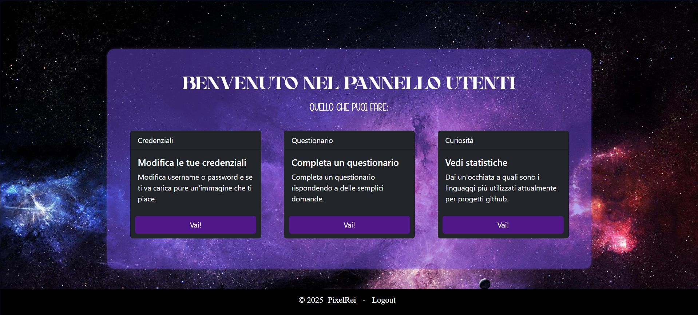
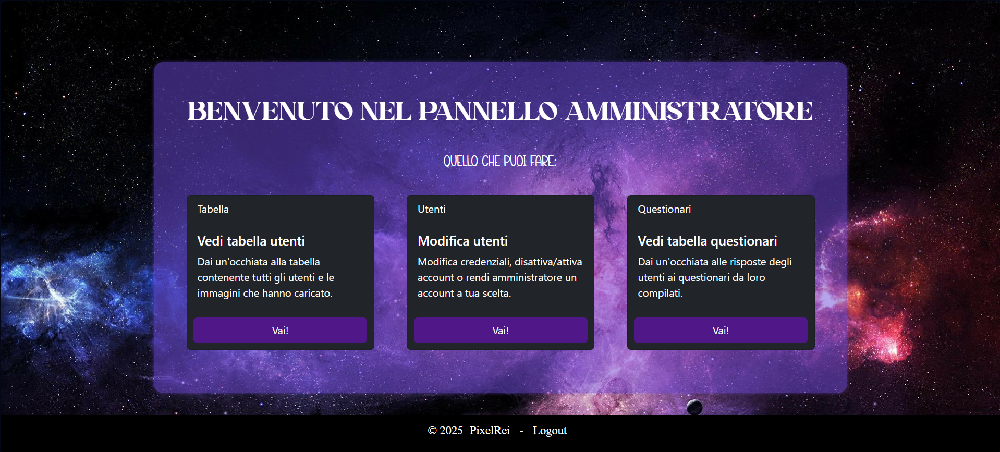
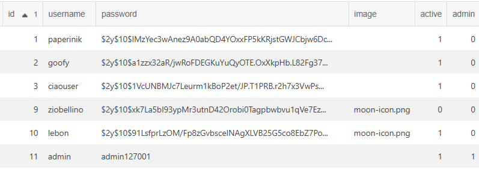
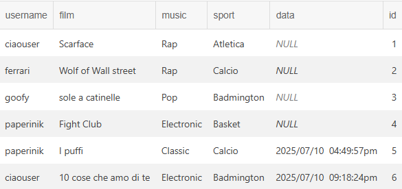

# PHP Stage Project

This is a project created by me during my internship period.
It consists in a site connected to a database, which contains lots of important information.

## How it starts 🌟

The first page has a login form, with also the option of creating an account if you don't have one.


If you need to create an account you can click on the option under the login button and insert your credentials in the next page. The username and the password will be saved in a database.

So you'll see...


And then...


## Types of Account ⚙️

There are two types of account which are the users and the admin.
Inside the database, in a table, there is a "flag" named admin with a bool value that indicates if the account has admin permissions or not. If the value of admin is 0, which corresponds to false, the account is a normal user, otherwise if the value is greater than 0, the account has administrator permissions.

According to what user logged in, there are two pages with different activities.

The user panel looks like this:



Where users can:

- Modifiy the credentials
- Complete a form
- View some stats about coding languages

And the admin panel looks like this: 



Where admin can:

- View a table with all the users 
- Modify users setting (activate/deactivate account, make admin someone ecc.) 
- View a table with users answers to the form 

## Connection to database 🛢

To connect PHP to the MySQL database I've used the PDO library (PHP Data OBjects).

First we create a PDO object to connect the file with the database.

```php
$db = new PDO("mysql:host=$hostname;dbname=$dbname", $user, $pass);
```
Of course we need to specify first the name of the database ($dbname), the host ($hostname), the user ($user) and the password ($pass).

Once that we connected the PHP file we can create the query to communicate with the database.
For example:

```php
$sql = "INSERT INTO people(username, password, active, admin) VALUES (:username, :password, :active, :admin)";
```
We just have to write in the $sql variable the SQL query that we want to use.

The database consists of two tables: people
and questionario.

### Database tables

The first table is used to store users credentials and other info: id, username, password, images uploaded, active and admin flags. 



The second one is used to store the answers to the forms completed by the users



## API Rest

#### The stats are served from

```http
  https://api.server.nbaapi.com/
```

### What stats we can get

- Player Totals: Provides season-based totals such as points, assists, rebounds, games played, shooting percentages, and more traditional statistics.

### Query parameters

| Parameter | Type     | Description                |
| :-------- | :------- | :------------------------- |
| `season` | `integer` | **Optional**, Filters by a specific season |

| Parameter | Type     | Description                       |
| :-------- | :------- | :-------------------------------- |
| `team`      | `string` | **Optional**, Filter by team abbreviation |

| Parameter | Type     | Description                       |
| :-------- | :------- | :-------------------------------- |
| `playerId`      | `string` | **Optional**. Filter by player's unique ID |

| Parameter | Type     | Description                       |
| :-------- | :------- | :-------------------------------- |
| `isPlayoff`      | `boolean` | **Optional**. Filter for a playoff statistics (true) or a regular season (false) |

| Parameter | Type     | Description                       |
| :-------- | :------- | :-------------------------------- |
| `page`      | `integer` | **Optional**. Page number to retrieve |

| Parameter | Type     | Description                       |
| :-------- | :------- | :-------------------------------- |
| `pageSize`      | `integer` | **Optional**. Number of record per page |

#### Example request

```http
  curl -X GET \
  'https://api.server.nbaapi.com/api/playeradvancedstats?page=1&pageSize=20&sortBy=win_shares&ascending=false&season=2025&team=MIL' \
  -H 'accept: application/json'
```

### Sorting Options for Advanced Stats

The `sortBy` parameter accepts the following values:
- `games` - Games played
- `minutes_played` - Total minutes played
- `ts_percent` - True Shooting Percentage
- `total_rb_percent` - Total Rebound Percentage
- `usage_percent` - Usage Percentage
- `offensive_ws` - Offensive Win Shares
- `defensive_ws` - Defensive Win Shares
- `win_shares` - Total Win Shares (default)
- `win_shares_per` - Win Shares per 48 minutes
- `offensive_box` - Offensive Box Plus/Minus
- `defensive_box` - Defensive Box Plus/Minus
- `box` - Total Box Plus/Minus  
- `vorp` - Value Over Replacement Player
- `season` - Season year

There is no json file directly used as I've already used the json_decode function in php.

## Security 🛡️

To guarantee the security of the website all the password are hashed with the method password_hash() and then checked with password_verify().

And to avoid SQL Injection all the parameters are binded when creating queries.