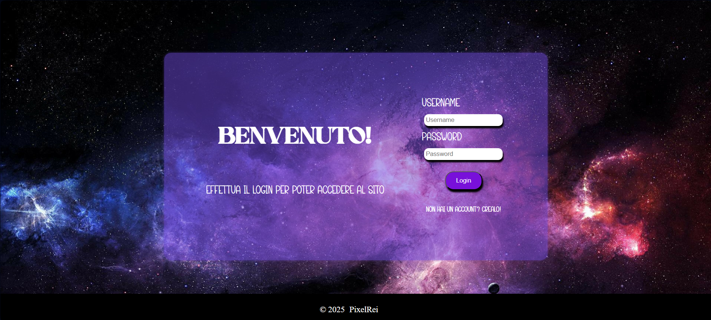

# PHP Stage Project

This is a project created by me during my internship period.
It consists in a site connected to a database, which contains lots of important information.

## How it starts

The first page has a login form, with also the option of creating an account if you don't have one.

If you need to create an account you can click on the option under the login button and insert your credentials in the next page. The username and the password will be saved in a database.

So you'll see...

And then...

## Types of Account

There are two types of account which are the users and the admin.
Inside the database, in a table, there is a "flag" named admin with a bool value that indicates if the account has admin permissions or not. If the value of admin is 0, which corresponds to false, the account is a normal user, otherwise if the value is greater than 0, the account has administrator permissions.

According to what user logged in, there are two pages with different activities.

The user panel looks like this:

### What users can do

- Modifiy the credentials
- Complete a form
- View some stats about coding languages

And the admin panel looks like this: 

### What admin can do

- View a table with all the users 
- Modify users setting (activate/deactivate account, make admin someone ecc.) 
- View a table with users answers to the form 